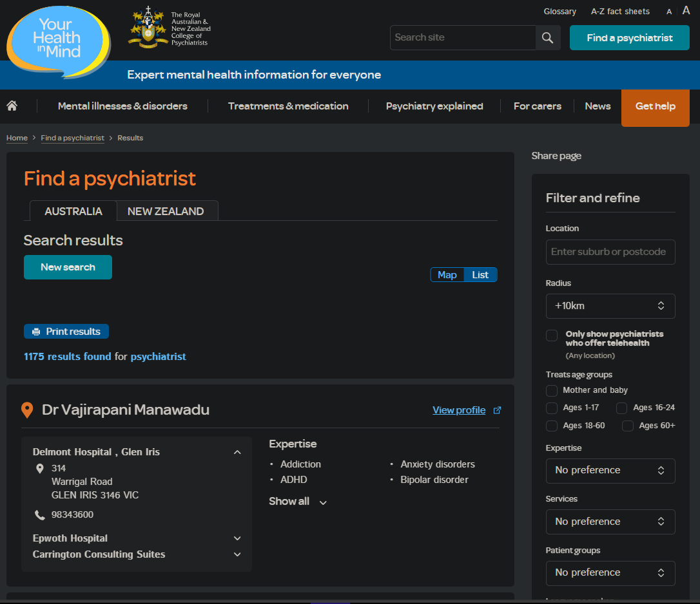

# psychiatrists-contact-extractor
This repository contains scripts and tools for extracting contact information of psychiatrists in Australia from https://www.yourhealthinmind.org/find-a-psychiatrist/. The project includes web scraping scripts in Python using libraries like Scrapy, Selenium, and Beautiful Soup. The extracted data is organized in a CSV format for easy analysis and use

Blurred Showcase

A blurred version of the contacts.csv file is included in the repository for privacy reasons. This blurred version demonstrates the data structure without revealing sensitive information.
